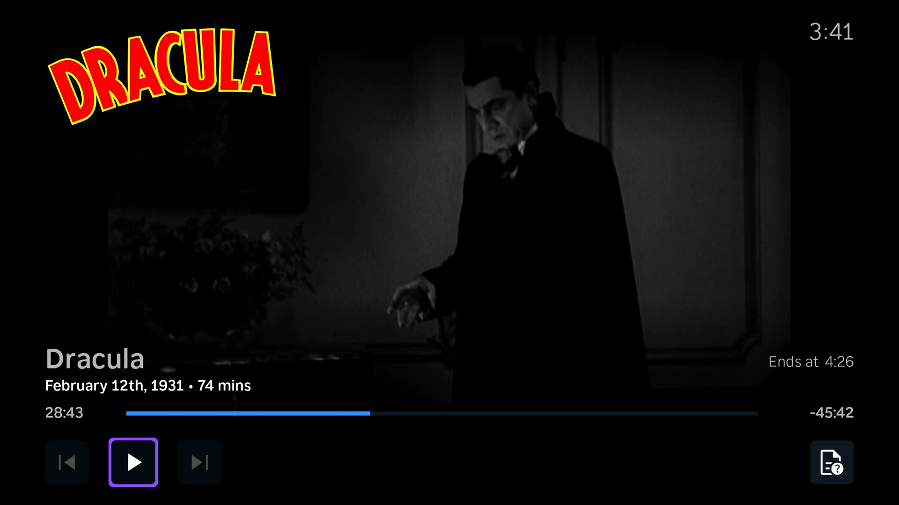

<!-- markdownlint-disable MD041 -->


[](https://github.com/cewert/jellyrock/releases)
[](https://github.com/cewert/jellyrock/actions/workflows/build.yml?query=branch%3Amain)
[](https://cewert.github.io/jellyrock-code-docs/)
[](LICENSE)
<!-- [](https://translate.jellyfin.org/projects/jellyfin/jellyfin-roku/?utm_source=widget) -->

JellyRock is a Jellyfin client for Roku devices, forked from jellyfin-roku [v2.2.5](https://github.com/jellyfin-archive/jellyfin-roku-legacy/releases/tag/v2.2.5).

## Screenshots

  <a href="docs/screenshots/home.png" target="_blank" title="Home">
    
  </a>
  <a href="docs/screenshots/osd.png" target="_blank" title="On-Screen Display(OSD)">
    
  </a>

## Sideload

1. Put your Roku device in [developer mode](https://blog.roku.com/developer/2016/02/04/developer-setup-guide). Write down your Roku device IP and the password you created - you will need these!
2. Download the latest [build](https://github.com/cewert/jellyrock/actions/workflows/build.yml?query=branch%3Amain) created by GitHub Actions. Select the first item listed then click one of the links at the bottom of the page i.e. `JellyRock-prod-main-e34f4f169ff47531abd23ae3a11c102f6811f907`. This will download a zip file to your computer.
3. Put your Roku's IP from step 1 into a browser i.e. `http://192.168.1.2` and press enter.
4. Log in with credentials from step 1.
5. Upload and install the zip file downloaded in step 2.

> NOTE: The app will always be at the bottom of your Roku's channel list and it will *not* automatically update.

## Build

```bash
git clone https://github.com/cewert/jellyrock.git
cd jellyrock
npm install # --no-optional flag prevents postinstall failure on linux
npm run build # OR npm run build:prod
```

## User Docs

- [App Settings](docs/user/app-settings.md)

## Dev Docs

- [Dev Guide](docs/dev/DEVGUIDE.md)
