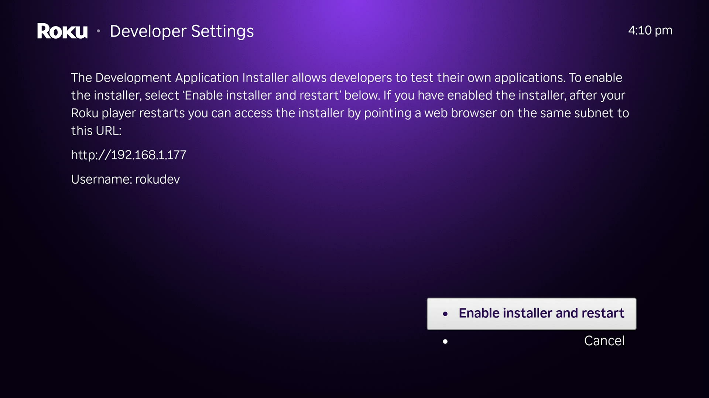
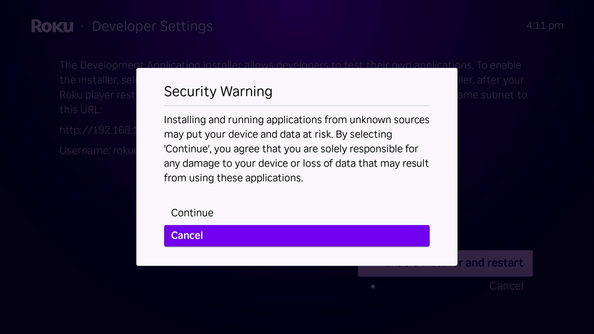
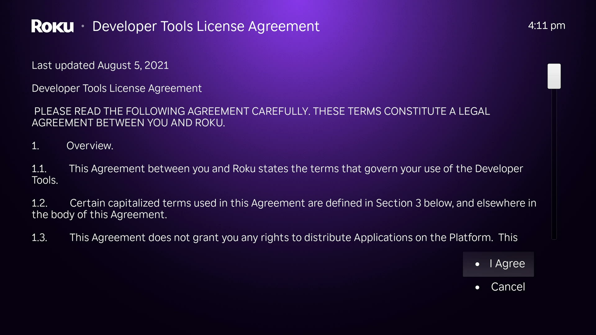
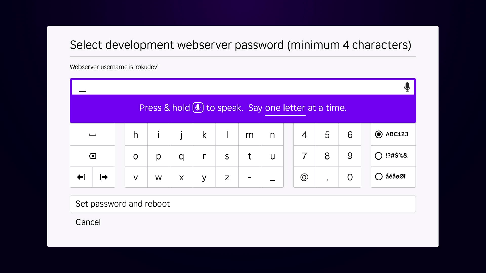

# Developer Mode for Roku Devices

Developer mode allows you to install (sideload) and test custom apps (called "channels") on your Roku device.

## What You'll Need

- A Roku account <https://my.roku.com>
- A Roku device linked to your Roku account and connected to the internet
- Enroll in the Developer Program <https://developer.roku.com>

## Enable Developer Mode

1. Press `🏠home` to exit out of any running application.

2. Press these buttons in order to open the secret menu.

    `🏠home` `🏠home` `🏠home` `⬆️up` `⬆️up` `➡️right` `⬅️left` `➡️right` `⬅️left` `➡️right`

3. Enable installer.

    

4. Acknowledge security risk.

    

5. Read and accept the [Roku SDK License Agreement](https://docs.roku.com/doc/developersdk/en-us).

    

6. Create a password and **save it somewhere safe**. This password protects your device from unauthorized access to development features.

    

## Troubleshooting

### Button sequence not working

Make sure you're on the Roku home page, verify you're pressing the buttons in the exact order shown, and try pointing the remote directly at your Roku device.

### I forgot my password

Repeat the [Developer Mode](#enable-developer-mode) instructions to disable Developer Mode and start over with a new password.

### I forgot my device IP

On your Roku device, navigate to `Settings` > `Network` > `About`.
